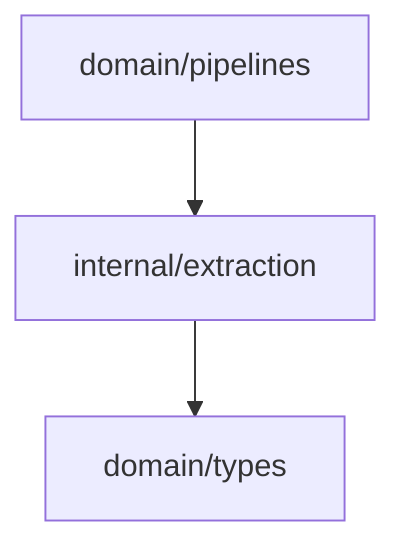

# Extraction Domain

The extraction domain turns classified document text into candidate entities.

## Responsibility

- Route a document to a structured extractor (OpenAPI, spreadsheet, Jira, GitHub) when its source metadata identifies one.
- Fall back to generic regex token extraction for unstructured or unparseable content.
- Deduplicate candidates within one document.
- Infer a coarse entity type.
- Attach source spans, raw mention text, confidence, and extraction method to every entity.
- Preserve the source document ID and classification metadata.

## Input And Output

```mermaid
flowchart LR
  classified[ClassifiedDocument]
  extract[Extract]
  entities[[]Entity]

  classified --> extract --> entities
```

## Key API

```go
func Extract(doc types.ClassifiedDocument) []types.Entity
```

Internal helper:

```go
func inferType(name string, classification types.Classification) types.EntityType
```

## Routing

`Extract` inspects document metadata and dispatches to a structured extractor, falling back to
generic token extraction when no structured signal is present or a structured parse yields nothing:

| Metadata signal                    | Extractor         | Method label   |
| ---------------------------------- | ----------------- | -------------- |
| `filesystem_format = openapi_spec` | OpenAPI pointers  | `openapi`      |
| `filesystem_format = spreadsheet`  | Spreadsheet cells | `spreadsheet`  |
| `connector = jira` (JSON body)     | Jira `fields`     | `jira_field`   |
| `connector = github` (JSON body)   | GitHub top fields | `github_field` |
| otherwise                          | Regex tokens      | `regex_token`  |

Structured extractors return nothing for non-matching content, so the dispatcher safely falls back
to regex tokens (this keeps the reasoning harness deterministic for plain-text fixtures).

## Candidate Pattern

The token fallback uses this regular expression:

```text
[A-Za-z][A-Za-z0-9_]*(?:Status|State|ID|Id|Type|Flag|Field|Column)?
```

Candidates shorter than three characters are ignored. Deduplication is case-insensitive within one document.

## Type Inference

| Condition                                                                 | Entity Type   |
| ------------------------------------------------------------------------- | ------------- |
| name contains `field`                                                     | `APIField`    |
| name contains `status` or `state` and looks schema-like (`refundStatus`) | `APIField`    |
| name contains `column` or `database`                                      | `DBColumn`    |
| name contains `type` or `flag`                                            | `Enum`        |
| document classification is `BusinessLogic`                                | `Requirement` |
| document classification is `APIDiscussion`                                | `Service`     |
| fallback                                                                  | `Dependency`  |

## Entity Shape

Each extracted entity receives:

- `ID`: document ID plus lowercase entity key.
- `Type`: inferred entity type.
- `Name`: normalized candidate text.
- `RawMention`: original source text before normalization.
- `SourceID`: normalized document ID.
- `Confidence`: extraction certainty (`0.5` for regex tokens, `0.9` for structured extractions).
- `ExtractionMethod`: how the entity was produced (`regex_token`, `openapi`, `spreadsheet`, `jira_field`, `github_field`).
- `Spans`: rune offsets (token path) or structured pointers/cell references (structured paths).
- `Metadata`: `classification`, plus `source_uri` and upstream `source_id` when present for downstream evidence.

## Dependencies



## Example Usage

```go
extracted := extraction.Extract(classified)
```

## Implementation Notes

- The current extractor is intentionally deterministic and light. It is a candidate generator, not final truth.
- Keep `SourceID` intact because identity, relationship, and reasoning depend on provenance.
- Add tests before changing token behavior; extraction changes quickly affect graph shape and mismatch detection.

## Production Requirements

- Emit source spans or structured field paths for every extracted entity.
- Include extraction confidence and extraction method metadata.
- Support structured inputs such as Jira fields, filesystem documents, OpenAPI schemas, and spreadsheet cells.
- Preserve raw mention text separately from normalized entity names.

## Status

Source spans, raw mention text, confidence, and extraction-method metadata are implemented for both
the token fallback and the OpenAPI, spreadsheet, Jira, and GitHub structured extractors, with tests
in `extraction_test.go`.
