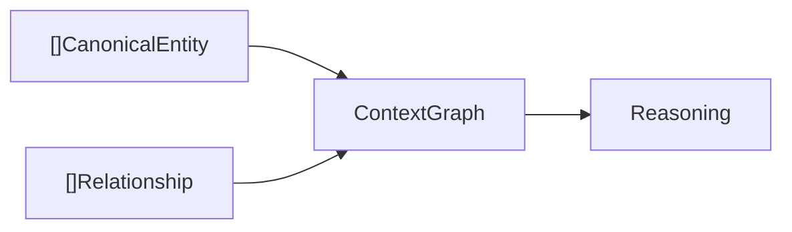
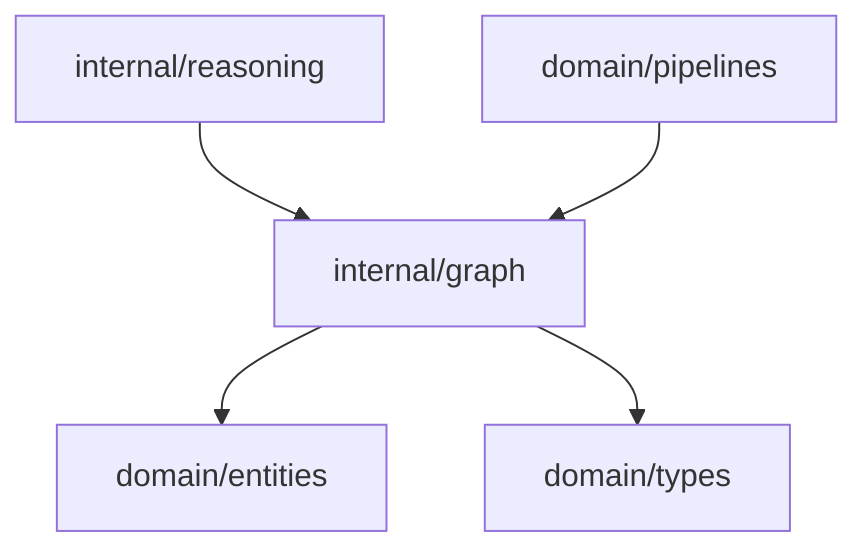

# Context Graph Domain

The graph domain materializes canonical entities and relationships into an in-memory context graph.

## Responsibility

- Store canonical entities by entity ID.
- Store relationships by relationship ID.
- Provide the graph structure consumed by reasoning.

## Graph Shape

```go
type ContextGraph struct {
    Entities      map[string]entities.CanonicalEntity `json:"entities"`
    Relationships map[string]types.Relationship       `json:"relationships"`
}
```

## Key API

```go
func New() *ContextGraph
func (g *ContextGraph) AddEntities(input []entities.CanonicalEntity)
func (g *ContextGraph) AddRelationships(input []types.Relationship)
```

## Input And Output



## Behavior

- `New` initializes empty entity and relationship maps.
- `AddEntities` overwrites existing entries with the same entity ID.
- `AddRelationships` overwrites existing entries with the same relationship ID.

## Dependencies



## Example Usage

```go
contextGraph := graph.New()
contextGraph.AddEntities(canonical)
contextGraph.AddRelationships(relationships)
```

## Implementation Notes

- This graph is not persistent yet. It is the current materialized view for one pipeline run.
- Map overwrites are acceptable today but should become explicit merge semantics once graph history and replay are added.
- Future storage should preserve aliases, provenance, version history, and relationship evidence.

## Production Requirements

- Persist graph snapshots locally with replayable stage outputs.
- Preserve entity and relationship history rather than only the latest map value.
- Support impact queries across requirement, API, DB, service, and delivery artifacts.
- Expose graph state in a way reasoning and presentation can audit.
