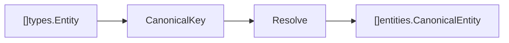
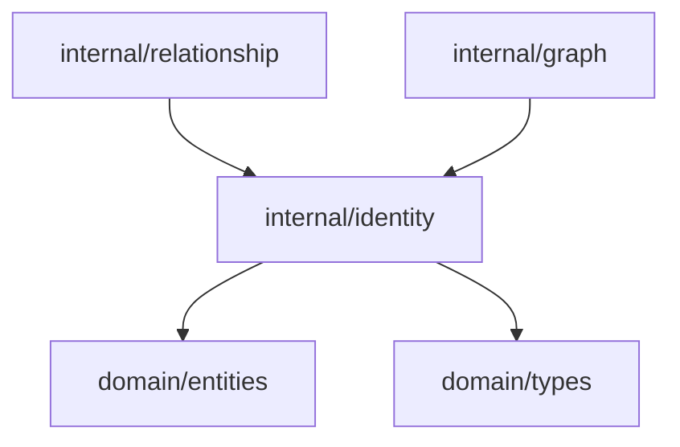

# Identity Resolution Domain

Identity resolution is the core ContextOS domain. It merges candidate entities that represent the same concept into canonical identities.

## Responsibility

- Convert extracted `types.Entity` values into `entities.CanonicalEntity` values.
- Preserve aliases for names that collapse to the same canonical key.
- Return canonical entities in first-seen order.
- Surface confidence and human-review state.

## Input And Output



## Key API

```go
func Resolve(input []types.Entity) []entities.CanonicalEntity
func CanonicalKey(value string) string
```

Internal helper:

```go
func appendUnique(values []string, next string) []string
```

## Canonical Key Rules

`CanonicalKey` applies two operations:

1. Trim surrounding whitespace and lowercase the value.
2. Replace non-`a-z0-9` runs with an empty string.

Examples:

| Input           | Key            |
| --------------- | -------------- |
| `refund_status` | `refundstatus` |
| `Refund Status` | `refundstatus` |
| `refund-status` | `refundstatus` |

## Resolve Behavior

1. Create a canonical map keyed by `CanonicalKey(entity.Name)`.
2. For the first entity with a key, append its name as the first alias and store confidence `1` with `NeedsHuman=false`.
3. For later entities with the same key, append the new name to aliases if unique.
4. Return canonical entities in first-seen key order.

## Dependencies



## Example Usage

```go
canonical := identity.Resolve(extracted)
```

## Implementation Notes

- Current matching is exact after normalization. It does not yet handle semantic similarity, multilingual aliases, or conflict scoring.
- `Confidence` is currently binary because the algorithm is deterministic.
- Future fuzzy or semantic matching should preserve evidence, explain confidence, and set `NeedsHuman` for ambiguous merges.
- Keep alias order stable. It is useful for deterministic tests and human inspection.

## Production Requirements

- Support alias dictionaries, naming-convention transforms, multilingual aliases, and semantic candidates.
- Score candidates with explainable evidence and calibrated confidence.
- Detect conflicting merges and set `NeedsHuman` with review reasons.
- Maintain benchmark coverage for precision, recall, multilingual names, and merge conflicts.
