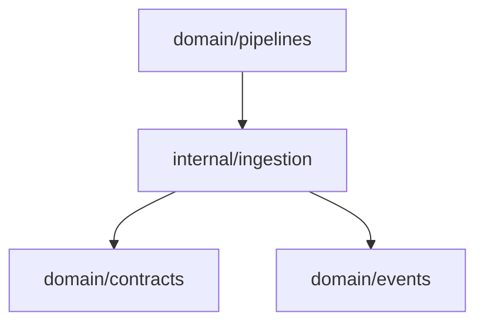

# Ingestion Domain

The ingestion domain fans a source request through one or more registered connectors and returns the combined events.

## Responsibility

- Own connector registration for a local pipeline run.
- Execute each connector with the same source request.
- Preserve connector output order.
- Stop and return an error when any connector fails.

## Input And Output

```mermaid
flowchart LR
  request[contracts.SourceRequest]
  pipeline[ingestion.Pipeline]
  connectors[MCPSourceConnector list]
  events[[]events.Event]

  request --> pipeline --> connectors --> events
```

## Key API

```go
type Pipeline struct {
    connectors []contracts.MCPSourceConnector
}

func NewPipeline(connectors ...contracts.MCPSourceConnector) Pipeline
func (p Pipeline) Ingest(ctx context.Context, req contracts.SourceRequest) ([]events.Event, error)
```

## Behavior

1. Iterate through registered connectors in constructor order.
2. Call `connector.Ingest(ctx, req)` for each connector.
3. Return immediately if any connector returns an error.
4. Append all connector events into one slice.

## Dependencies



## Example Usage

```go
pipe := ingestion.NewPipeline(
    githubsource.NewConnector(),
    slacksource.NewConnector(),
)
events, err := pipe.Ingest(ctx, req)
```

## Implementation Notes

- The stage is intentionally simple. It is orchestration, not parsing.
- Future deduplication should use event/source metadata rather than suppressing connector calls here.
- If parallel ingestion is introduced later, keep result ordering and error reporting explicit.

## Production Requirements

- Persist raw source payload references before downstream processing.
- Carry a trace ID through all emitted events.
- Support retry policies without duplicating accepted events.
- Report structured stage errors for connector, validation, and cancellation failures.
