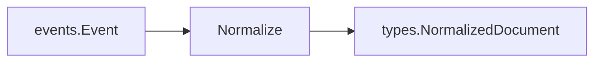
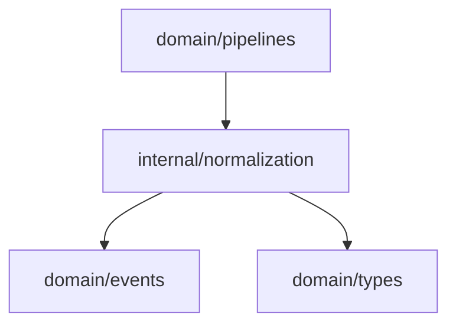

# Normalization Domain

The normalization domain converts source events into a common document shape that downstream stages can process without connector-specific logic.

## Responsibility

- Convert `events.Event` into `types.NormalizedDocument`.
- Trim human-facing title and body text.
- Preserve source, event type, event ID, and metadata.
- Record a UTC normalization timestamp.

## Input And Output



## Key API

```go
func Normalize(event events.Event) types.NormalizedDocument
```

## Behavior

- Uses `event.ID` as the normalized document ID.
- Uses `event.Source` as the document source.
- Uses `string(event.Type)` as the source type.
- Uses trimmed `event.Subject` as the title.
- Uses trimmed `event.Content` as the body.
- Copies event metadata into a new map.
- Sets `NormalizedAt` with `time.Now().UTC()`.

## Dependencies



## Example Usage

```go
doc := normalization.Normalize(event)
```

## Implementation Notes

- Metadata is copied so later stages cannot mutate the original event map by accident.
- Keep normalization deterministic except for the processing timestamp.
- Future normalizers should keep raw source provenance rather than replacing it with derived labels.

## Production Requirements

- Produce stable normalized document IDs derived from source identity and content version.
- Preserve source spans, content hashes, schema version, and normalization rule version.
- Keep transforms reproducible from raw input and metadata.
- Add regression tests for connector-specific normalization behavior.
