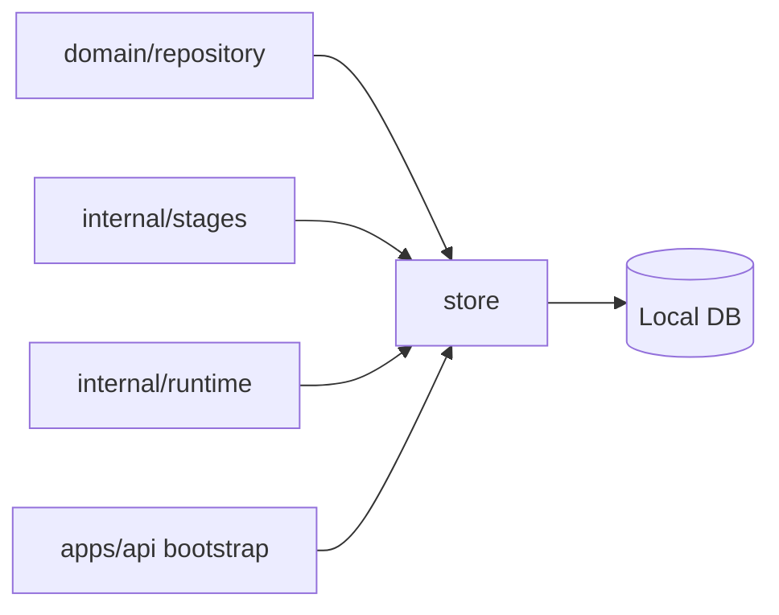

# Persistence

The `internal/persistence` tree contains storage implementations behind domain repository contracts. It keeps Local DB and adapter details away from pipeline stages, runtime services, and API handlers.

## Packages

| Package | Responsibility |
| --- | --- |
| [`store/`](store/README.md) | Implements Local DB backed repositories for workspace, source, artifact, graph, finding, and chat evidence state. |

## Persistence Boundary

Callers should depend on repository-style behavior, not storage-specific details.

## Maintenance Checklist

- Update [`store/`](store/README.md) when repository behavior, schema assumptions, or storage adapters change.
- Keep stable repository contracts in [`domain/repository`](../../domain/repository/README.md).
- Run store and affected API tests after persistence behavior changes.
