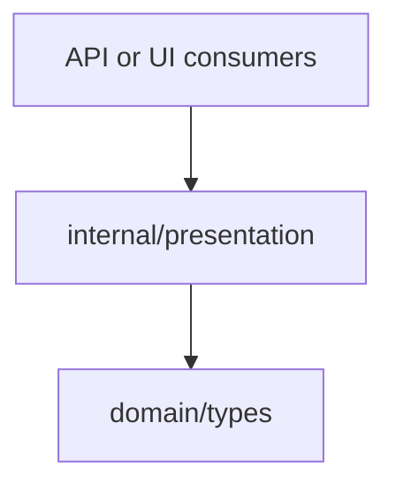

# Presentation Domain

The presentation domain shapes reasoning outputs for a target role.

## Responsibility

- Convert mismatch findings into role-oriented summaries.
- Keep output predictable for API, CLI, or UI consumers.
- Provide a thin formatting layer rather than new reasoning logic.

## Roles

```go
type Role string

const (
    PMO          Role = "pmo"
    Frontend     Role = "frontend"
    Backend      Role = "backend"
    QA           Role = "qa"
    Architecture Role = "architecture"
)
```

## Key API

```go
func RenderSummary(role Role, mismatches []types.Mismatch) string
```

## Behavior

- If there are no mismatches, returns `<role> view: no delivery mismatches detected`.
- If mismatches exist, returns a header with count and one bullet per finding.
- Each finding line includes severity and summary.

## Input And Output

```mermaid
flowchart LR
  mismatches[[]Mismatch]
  role[Role]
  render[RenderSummary]
  summary[string]

  mismatches --> render
  role --> render
  render --> summary
```

## Dependencies



## Example Usage

```go
summary := presentation.RenderSummary(presentation.Frontend, result.Mismatches)
```

## Implementation Notes

- Keep this layer focused on formatting. New detection rules belong in reasoning.
- Role-specific wording can grow here, but it should not hide severity, impact, evidence, or recommended actions.
- When findings become richer, presentation should expose confidence and evidence in role-friendly language.

## Production Requirements

- Render role-specific summaries for PMO, frontend, backend, QA, and architecture without losing evidence.
- Show confidence, impact, severity, affected artifacts, and recommended next action.
- Keep output stable enough for API/UI tests.
- Separate detected facts from recommendations and AI-assisted narrative.
