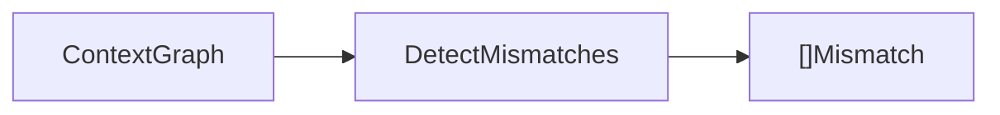
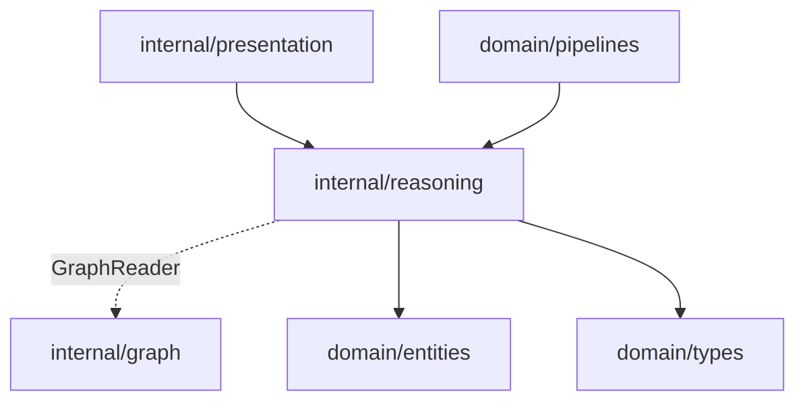

# Reasoning Domain

The reasoning domain analyzes the context graph and emits delivery mismatch findings.

## Responsibility

- Inspect canonical entities and relationships.
- Detect cross-layer context misalignment and delivery understanding gaps.
- Produce actionable `types.Mismatch` findings.

## Input And Output



## Key API

```go
func DetectMismatches(g GraphReader) []types.Mismatch
```

`GraphReader` is the narrow interface consumed by reasoning:

```go
type GraphReader interface {
  AllEntities() []entities.CanonicalEntity
  AllRelationships() []types.Relationship
}
```

## Current Detection Rules

Reasoning currently runs four deterministic rules:

- `keyword_signal`: emit when entity names contain `missing`, `mismatch`, or `outdated`.
- `requirement_gap`: emit when a `Requirement` has no `requirement_affects_api` or `requirement_affects_service` edge.
- `cross_layer_contract_drift`: emit when an `APIField` has explicit contract exposure context (typed edge other than `co_occurs_in_document`) but no `api_backed_by_db` edge.
- `dependency_risk`: emit for every `service_depends_on` edge.

For keyword findings, the emitted mismatch uses:

- `ID`: `keyword_signal:<entity id>`
- `Type`: `keyword_signal`
- `Summary`: `Potential delivery mismatch around <entity name>`
- `EntityIDs`: the single matching entity ID
- `Severity`: `medium`
- `Confidence`: `0.70`
- `Impact`: `medium`
- `Evidence`: source URI plus entity fragment when available, otherwise the entity source ID
- `Recommended`: confirmation guidance across knowledge layers (presentation, service, PMO)

All findings include:

- confidence in `[0,1]`
- evidence references
- severity and impact
- affected roles
- recommended action

## Dependencies



## Example Usage

```go
mismatches := reasoning.DetectMismatches(contextGraph)
```

## Implementation Notes

- This is intentionally explainable but not production-complete. It is the first deterministic rule for cross-layer context drift detection.
- Findings include confidence, impact, and evidence back to source artifacts.
- Avoid opaque AI-only findings. AI output should support or rank evidence, not replace provenance.
- Add tests for every detection rule because reasoning changes directly affect the first production success metric.

## Production Requirements

- Detect cross-layer contract drift, PMO status drift, requirement gaps, outdated implementation assumptions, and dependency risks.
- Emit confidence, impact, affected roles, evidence, severity, and recommended action for every finding.
- Keep false-positive tracking and regression fixtures for real or realistic delivery artifacts.
- Treat execution output as supporting evidence only when it can be traced and reviewed.
