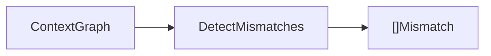
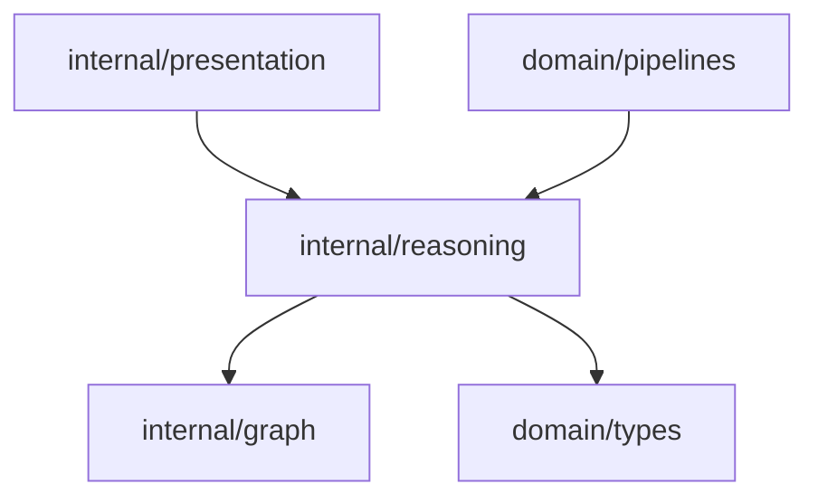

# Reasoning Domain

The reasoning domain analyzes the context graph and emits delivery mismatch findings.

## Responsibility

- Inspect canonical entities and relationships.
- Detect likely FE/BE or delivery understanding mismatches.
- Produce actionable `types.Mismatch` findings.

## Input And Output



## Key API

```go
func DetectMismatches(g *graph.ContextGraph) []types.Mismatch
```

## Current Detection Rule

For every canonical entity in the graph, lowercase the entity name and emit a mismatch when it contains any of:

- `missing`
- `mismatch`
- `outdated`

The emitted finding uses:

- `ID`: `mismatch:<entity id>`
- `Summary`: `Potential delivery mismatch around <entity name>`
- `EntityIDs`: the single matching entity ID
- `Severity`: `medium`
- `Recommended`: confirmation guidance for FE and BE understanding

## Dependencies



## Example Usage

```go
mismatches := reasoning.DetectMismatches(contextGraph)
```

## Implementation Notes

- This is intentionally explainable but not production-complete. It is the first deterministic rule for FE/BE drift detection.
- Production findings must include confidence, impact, and evidence back to source artifacts.
- Avoid opaque AI-only findings. AI output should support or rank evidence, not replace provenance.
- Add tests for every detection rule because reasoning changes directly affect the first production success metric.

## Production Requirements

- Detect FE/BE contract drift, PMO status drift, requirement gaps, outdated implementation assumptions, and dependency risks.
- Emit confidence, impact, affected roles, evidence, severity, and recommended action for every finding.
- Keep false-positive tracking and regression fixtures for real or realistic delivery artifacts.
- Treat execution output as supporting evidence only when it can be traced and reviewed.
