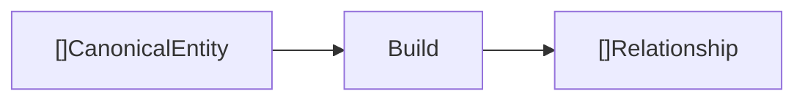
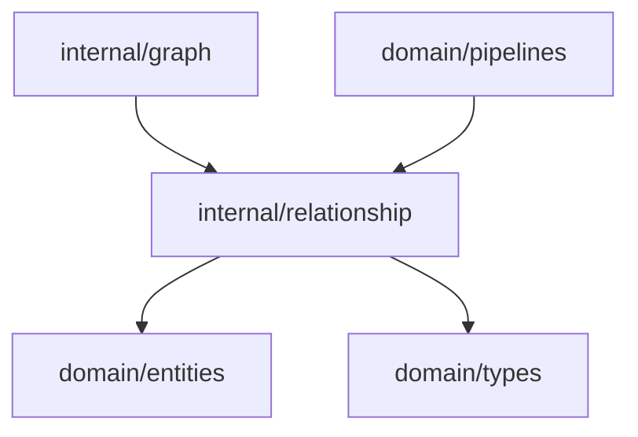

# Relationship Domain

The relationship domain creates edges between canonical entities so the context graph can represent how concepts are connected.

## Responsibility

- Convert canonical entities into graph relationships.
- Preserve source provenance on relationship metadata.
- Keep relationship IDs deterministic for the current input ordering.

## Input And Output



## Key API

```go
func Build(canonical []entities.CanonicalEntity) []types.Relationship
```

## Behavior

The current implementation links adjacent canonical entities when both came from the same source document.

For each pair `canonical[i]` and `canonical[i+1]`:

- Skip the pair if `SourceID` differs.
- Create relationship ID as `from.ID + "->" + to.ID`.
- Set `Kind` to `co_occurs_in_document`.
- Store `source_id` metadata.

## Dependencies



## Example Usage

```go
relationships := relationship.Build(canonical)
contextGraph.AddRelationships(relationships)
```

## Implementation Notes

- This stage currently models co-occurrence, not causality or ownership.
- Future relationship kinds should be explicit and documented as stable vocabulary.
- Preserve provenance in metadata so reasoning findings can point back to source evidence.
- Add tests when relationship construction becomes more than adjacent entity linking.

## Production Requirements

- Define a stable relationship kind vocabulary with direction, semantics, and examples.
- Include relationship confidence and evidence references.
- Support edges such as requirement-affects-api, api-backed-by-db, ticket-implements-requirement, and discussion-conflicts-with-spec.
- Validate graph constraints so invalid edges do not silently enter persistent storage.
