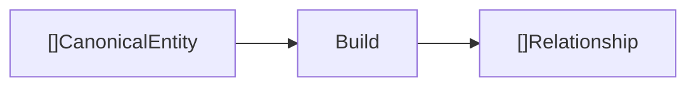
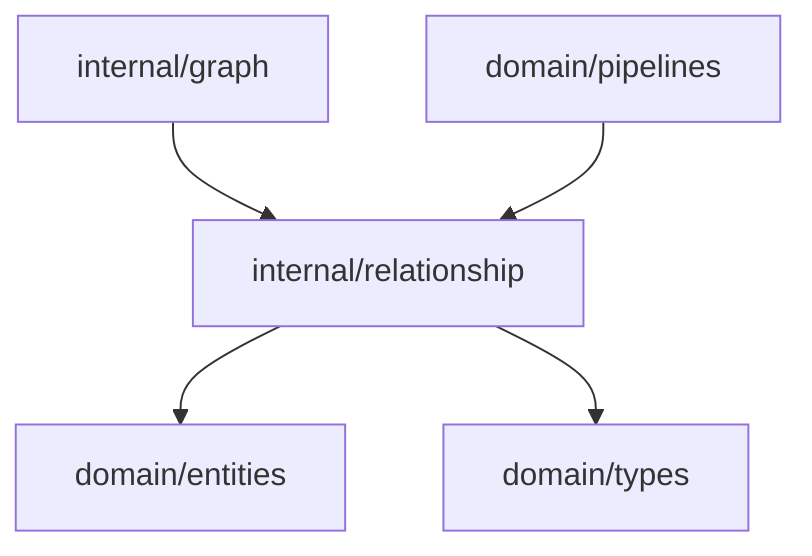

# Relationship Domain

The relationship domain creates edges between canonical entities so the context graph can represent how concepts are connected.

## Responsibility

- Convert canonical entities into graph relationships.
- Preserve source provenance on relationship metadata.
- Keep relationship IDs deterministic for the current input ordering.

## Input And Output



## Key API

```go
func Build(canonical []entities.CanonicalEntity) []types.Relationship
func Validate(rel types.Relationship) error
```

## Behavior

`Build` inspects every distinct pair of canonical entities that share a `SourceID` and classifies
the edge from the two entity types. Each emitted edge carries a confidence score and evidence
references back to both endpoints, and every edge is checked with `Validate` before it is returned.

For each same-source pair:

- Skip the pair if `SourceID` differs.
- Orient and type the edge using the relationship-kind vocabulary below.
- Fall back to `co_occurs_in_document` when no typed delivery rule applies.
- Create relationship ID as `from.ID + "->" + to.ID + ":" + kind` so distinct edge kinds never collide.
- Set `Confidence` (0.8 for typed edges, 0.5 for co-occurrence) and `Evidence` (`source#name` for both endpoints).
- Store `source_id` metadata.
- Drop edges that fail `Validate` (empty endpoints, self-loops, or empty kind) so invalid edges never reach storage.

## Relationship Kind Vocabulary

| Kind                          | Direction                    | Meaning                                              |
| ----------------------------- | ---------------------------- | ---------------------------------------------------- |
| `requirement_affects_api`     | requirement → api_field      | A requirement constrains or drives an API field.     |
| `requirement_affects_service` | requirement → service        | A requirement is delivered by a service.             |
| `api_backed_by_db`            | api_field → db_column        | An API field is persisted by a database column.      |
| `enum_constrains_field`       | enum → api_field / db_column | An enum restricts the values of a field or column.   |
| `service_depends_on`          | service → dependency         | A service relies on a dependency.                    |
| `co_occurs_in_document`       | entity → entity              | Fallback: both entities appeared in the same source. |

## Dependencies



## Example Usage

```go
relationships := relationship.Build(canonical)
contextGraph.AddRelationships(relationships)
```

## Implementation Notes

- Typed edges model real delivery semantics (requirement → api → db, service → dependency); untyped pairs degrade to co-occurrence.
- Relationship kinds are a stable `types.RelationshipKind` vocabulary documented above.
- Confidence and evidence are populated on every edge so reasoning findings can point back to source evidence.
- `Validate` enforces graph constraints so invalid edges do not silently enter persistent storage.

## Production Requirements

- [x] Define a stable relationship kind vocabulary with direction, semantics, and examples.
- [x] Include relationship confidence and evidence references.
- [x] Support edges such as requirement-affects-api, api-backed-by-db, and service-depends-on.
- [x] Validate graph constraints so invalid edges do not silently enter persistent storage.
- [ ] Add semantic/relationship-similarity inference beyond same-source pairing.
