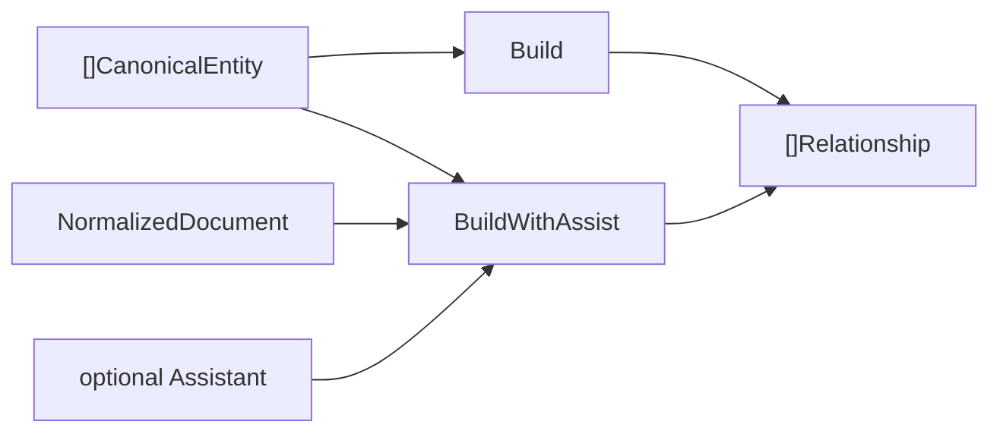
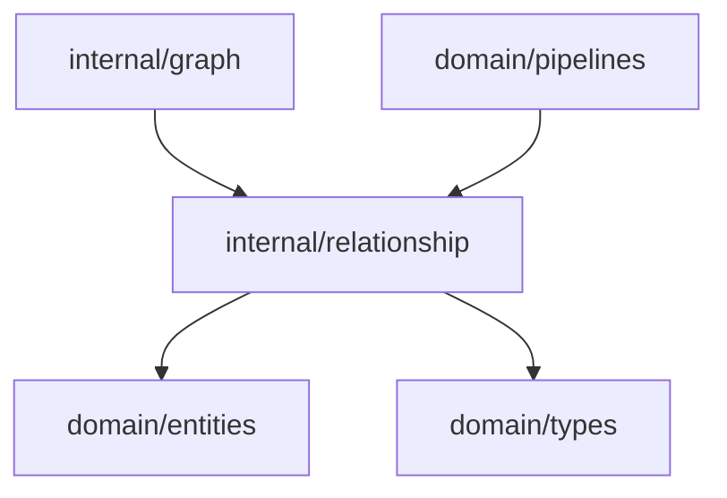

# Relationship Domain

The relationship domain creates edges between canonical entities so the context graph can represent how concepts are connected.

## Responsibility

- Convert canonical entities into graph relationships.
- Preserve source provenance on relationship metadata.
- Keep relationship IDs deterministic for the current input ordering.

## Input And Output



## Key API

```go
func Build(canonical []entities.CanonicalEntity) []types.Relationship
func BuildWithAssist(ctx context.Context, doc types.NormalizedDocument, canonical []entities.CanonicalEntity, assistant Assistant) []types.Relationship
func Validate(rel types.Relationship) error
```

## Behavior

`Build` inspects every distinct pair of canonical entities that share a `SourceID` and classifies
the edge from the two entity types. Each emitted edge carries a confidence score and evidence
references back to both endpoints, and every edge is checked with `Validate` before it is returned.

`BuildWithAssist` keeps that deterministic output as the baseline, then optionally asks an
`Assistant` for additional same-document edges. Assistant output is accepted only when it uses a
known relationship kind, references existing canonical entities from the same normalized document,
is not a self-loop, has confidence at least `0.75`, and cites evidence text found in the document
title or body. Assistant errors or rejected proposals degrade to deterministic `Build` output.

For each same-source pair:

- Skip the pair if `SourceID` differs.
- Orient and type the edge using the relationship-kind vocabulary below.
- Fall back to `co_occurs_in_document` when no typed delivery rule applies and the pair is not low-confidence regex-only noise.
- Create relationship ID as `from.ID + "->" + to.ID + ":" + kind` so distinct edge kinds never collide.
- Set `Confidence` (0.8 for typed edges, 0.5 for co-occurrence) and `Evidence` (`source#name` for both endpoints).
- Store `source_id` metadata.
- Drop edges that fail `Validate` (empty endpoints, self-loops, or empty kind) so invalid edges never reach storage.

For each accepted assistant proposal:

- Preserve the deterministic relationship ID shape, `from.ID + "->" + to.ID + ":" + kind`.
- Reject duplicates of deterministic edges.
- Set metadata `assistive=true`, `assist_provider=<provider>`, `assist_evidence=<source quote>`, and `source_id=<document id>`.
- Preserve the accepted evidence quote in `Relationship.Evidence`.

The Codex CLI assistant requires one compact output line:

```text
CONTEXTOS_RELATIONSHIPS_JSON: {"relationships":[{"from":"...","to":"...","kind":"api_backed_by_db","evidence":"...","confidence":0.86}]}
```

`NewCachedAssistant` wraps any assistant with a disk cache keyed by assistant version, provider,
document content hash, and sorted entity IDs so repeated runs avoid repeated Codex calls.

## Relationship Kind Vocabulary

| Kind                          | Direction                    | Meaning                                              |
| ----------------------------- | ---------------------------- | ---------------------------------------------------- |
| `requirement_affects_api`     | requirement → api_field      | A requirement constrains or drives an API field.     |
| `requirement_affects_service` | requirement → service        | A requirement is delivered by a service.             |
| `api_backed_by_db`            | api_field → db_column        | An API field is persisted by a database column.      |
| `enum_constrains_field`       | enum → api_field / db_column | An enum restricts the values of a field or column.   |
| `service_depends_on`          | service → dependency         | A service relies on a dependency.                    |
| `co_occurs_in_document`       | entity → entity              | Fallback: both entities appeared in the same source. |

## Dependencies



## Example Usage

```go
relationships := relationship.Build(canonical)
contextGraph.AddRelationships(relationships)

relationships = relationship.BuildWithAssist(ctx, doc, canonical, assistant)
contextGraph.AddRelationships(relationships)
```

## Implementation Notes

- Typed edges model real delivery semantics (requirement → api → db, service → dependency); untyped pairs degrade to co-occurrence only when they have enough provenance signal.
- Low-confidence `regex_token` dependency pairs no longer emit generic `co_occurs_in_document` links, which keeps stopword-like persisted entities from outranking delivery entities.
- Relationship kinds are a stable `types.RelationshipKind` vocabulary documented above.
- Confidence and evidence are populated on every edge so reasoning findings can point back to source evidence.
- `Validate` enforces graph constraints so invalid edges do not silently enter persistent storage.
- AI assistance can add validated typed edges, but it cannot create entities, delete deterministic edges, or infer across documents in this version.

## Production Requirements

- [x] Define a stable relationship kind vocabulary with direction, semantics, and examples.
- [x] Include relationship confidence and evidence references.
- [x] Support edges such as requirement-affects-api, api-backed-by-db, and service-depends-on.
- [x] Validate graph constraints so invalid edges do not silently enter persistent storage.
- [x] Add opt-in same-document relationship assistance with evidence and confidence gates.
- [ ] Add cross-document relationship inference after same-document assistance is benchmarked.
