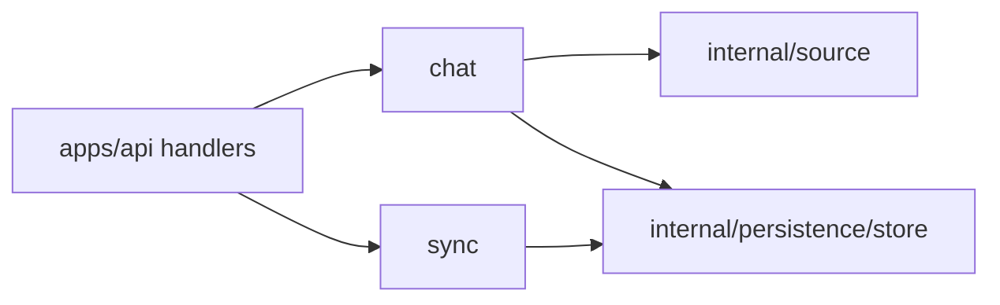

# Runtime Services

The `internal/runtime` tree contains product-facing services that sit between API handlers, source connectors, and persistence. These packages are not pipeline stages; they support live workflows such as chat answers and connector sync status.

## Packages

| Package | Responsibility |
| --- | --- |
| [`chat/`](chat/README.md) | Routes workspace chat intent, reads local evidence, performs live Codex lookup when needed, and saves answer evidence. |
| [`sync/`](sync/README.md) | Tracks connector sync lifecycle, status marking, cancellation, and background sync worker behavior. |

## Runtime Boundary

Runtime services may coordinate connectors and repositories, but deterministic pipeline transforms should stay in [`../stages/`](../stages/README.md).

## Maintenance Checklist

- Keep API handlers thin; runtime behavior belongs in these packages.
- Update package READMEs when chat, evidence saving, streaming, or sync status semantics change.
- Run package tests after changing runtime service behavior.
