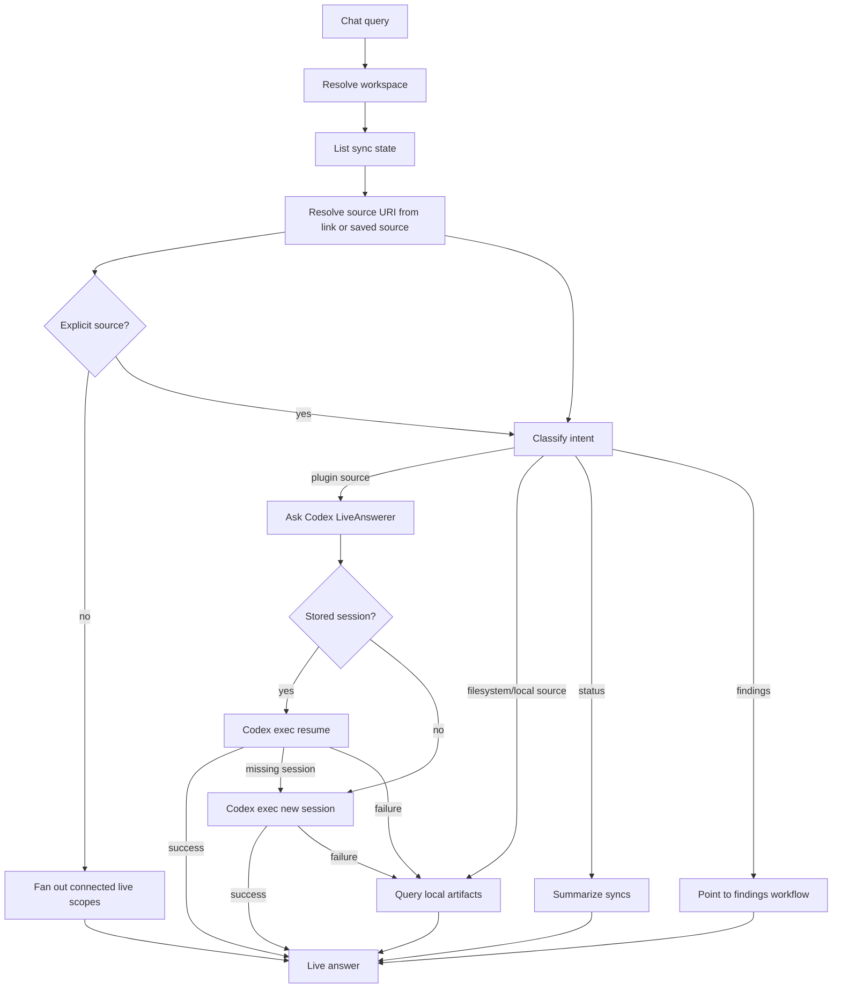

# Internal Chat

Chat service for answering workspace-scoped questions from persisted ContextOS repositories and optional Codex-backed live source context.

## Files

| File | Purpose |
| --- | --- |
| `answer_sections.go` | Parses structured live Codex JSON into backward-compatible answer text plus source-card sections. |
| `chat.go` | Classifies local chat intent, resolves workspace scope, queries artifacts and sync state, resets live session metadata, and builds answer summaries. |
| `codex_answerer.go` | Runs live Codex chat with workspace-scoped `codex exec` session metadata and `codex exec resume` on later turns. |
| `chat_test.go` | Verifies intent routing, workspace resolution, time range inference, and answer construction. |

## Behavior

The service supports artifact, status, findings, and unsupported intents. It always resolves workspace scope and lists connector sync state before answering. Explicit request fields from the frontend take precedence over message inference, so a concrete route such as `connector: "jira"` and `source_uri: "BKGDEV-8466"` remains issue-scoped even when the message is ambiguous. For plugin-backed connectors (`github`, `jira`, `slack`, `notion`, `googledrive`, `sharepoint`), source questions use a `LiveAnswerer` first when the message includes a source link or can be matched to a saved `connector_syncs` source. When a meaningful prompt has no explicit connector or source, the service fans out across connected live scopes in the order Jira, GitHub, Slack, Google Drive, Notion, SharePoint. Language-only, status, and findings prompts do not fan out. A connector-level connected source can use the connector name as `source_uri`, such as `github`; if live lookup fails, local fallback stays connector-wide instead of filtering to that literal URI. Filesystem questions remain local-first because filesystem content is ingested into ContextOS storage.

If live Codex lookup fails, the answer names the live failure and then falls back to local artifacts when available. Callers can provide `Query.Progress` to receive Codex-style transcript lines while the live lookup runs, including the plugin/source being checked, CLI startup/resume, heartbeat status from the API layer, and completion/failure notes. `Query.ResponseLanguage` is forwarded into the live prompt and deterministic local answer builders so Codex and local fallback/status responses match the current user prompt language when the frontend can infer it. Structured Codex JSON is parsed into `Result.AnswerSections` while `Result.Answer` remains a plain text summary for compatibility. The API chat handler persists concrete live answer sections as local evidence after successful Codex answers; this service does not write evidence directly. Local artifacts, graph output, findings, evidence, and confidence remain the auditable source of truth for double-checking and analysis.

Live Codex chat keeps one CLI conversation per workspace. The first live turn runs `codex exec --sandbox read-only --json --color never -o <tmp> <prompt>`, parses the `session_meta.payload.id` JSONL event, and stores that ID under `storage/codex-chat-sessions/<workspace-id>.json`. Later turns for the same workspace run `codex exec resume --json -o <tmp> <session-id> <prompt>`. Calls are serialized per workspace so two requests cannot race the same conversation. If the stored session is missing, archived, or unreadable, the answerer deletes the local pointer, starts a fresh session, and stores the new ID. `Service.ResetSession` deletes only the local session pointer; it does not archive or delete Codex global session files.

GitHub source questions infer the configured repository source from sync state when the user names only a repo slug such as `tourii-backend`. This keeps answers scoped to the requested repo instead of falling back to every GitHub artifact in the workspace. Pasted Jira, GitHub, Slack, Notion, Google Drive, and SharePoint links can route to the matching live plugin even when the exact source was not saved during setup. For GitHub, the live Codex prompt allows read-only `gh` commands as fallback context when the GitHub plugin cannot answer and the CLI is already authenticated. Live Codex prompts require JSON source sections with provenance fields so saved evidence remains useful in Activity and graph views instead of becoming one merged vague event.

## Maintenance Notes

- Keep filesystem answers deterministic and local-first.
- Keep live Codex answers labeled through `Result.Provider`.
- Preserve workspace scoping before querying artifacts or sync state.
- Update `apps/api/handler/chat/README.md` when service result fields change.
