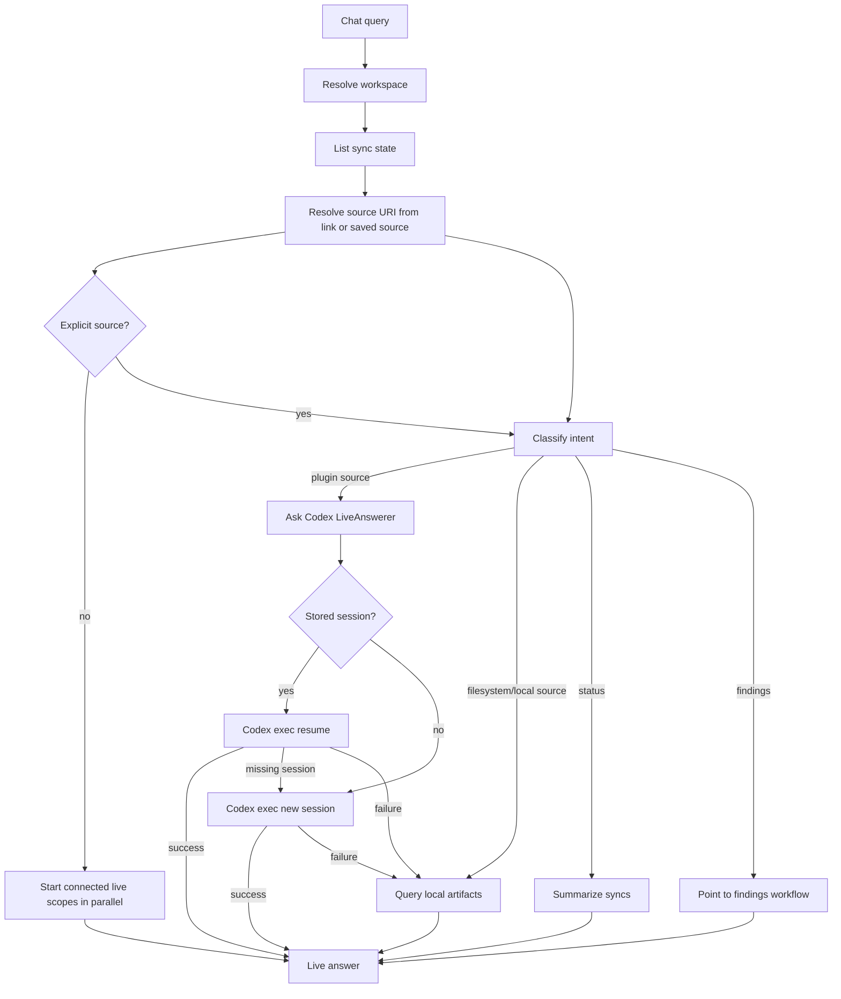

# Internal Chat

Chat service for answering workspace-scoped questions from persisted ContextOS repositories and optional Codex-backed live source context.

## Files

| File | Purpose |
| --- | --- |
| `answer_sections.go` | Parses structured live Codex JSON into backward-compatible answer text plus source-card sections. |
| `types.go` | Defines chat request, result, answer-section, live-query, and live-answerer contracts. |
| `service.go` | Resolves workspace scope, normalizes chat mode, routes intents, and resets live session metadata. |
| `local_answer.go` | Answers artifact intents with optional live lookup and local repository fallback. |
| `live_answer.go` | Runs multi-source live fanout, retries startup contention serially, and compacts live errors. |
| `intent.go` | Classifies top-level chat intent from the message and resolved source scope. |
| `scope.go` | Selects connected live source scopes and matches saved source names from user text. |
| `inference.go` | Infers connectors, source URIs, search text, and local date ranges from prompts. |
| `render.go` | Builds deterministic local, fanout, status, unsupported, and fallback answer text. |
| `language.go` | Normalizes response language hints and detects English-heavy mixed prompts. |
| `helpers.go` | Holds small package-local helpers shared by the split chat files. |
| `codex_answerer.go` | Runs live Codex chat with workspace-and-connector scoped `codex exec` session metadata and `codex exec resume` on later turns. |
| `*_test.go` | Verifies service routing plus focused inference, scope, rendering, language, and helper behavior. |

## Testing

Run focused chat runtime tests after changing service routing, inference, rendering, or live fanout behavior:

```bash
go test ./internal/runtime/chat
```

## Behavior

The service supports artifact, status, findings, and unsupported intents. It always resolves workspace scope and lists connector sync state before answering. Explicit request fields from the frontend take precedence over message inference, so a concrete route such as `connector: "jira"` and `source_uri: "BKGDEV-8466"` remains issue-scoped even when the message is ambiguous. `Query.Mode` accepts `auto`, `codex`, or `local`: auto uses live Codex first and then Local DB fallback, codex suppresses Local DB fallback, and local skips live lookup entirely. For plugin-backed connectors (`github`, `jira`, `slack`, `notion`, `googledrive`, `sharepoint`), source questions use a `LiveAnswerer` first when the message includes a source link, matches a saved `connector_syncs` source, or falls back to a connector-level connected-account scope such as `github`. When a meaningful prompt has no explicit connector or source, the service starts every eligible connected source lookup concurrently and returns sections in stable connector order: Jira, GitHub, Slack, Google Drive, Notion, SharePoint. Concrete sources are preferred, but connector-level scopes can run as broad connected-account lookups when no concrete scope is saved. The plain chat answer synthesizes those sections into meaning, behavior, change/status, and open-item lines before naming evidence-source counts; the structured `answer_sections` remain the detailed per-source cards. Failed parallel lookups are retried serially once before local fallback so Codex CLI startup contention does not erase live answers. Language-only, status, and findings prompts do not fan out. Filesystem questions remain local-first because filesystem content is ingested into ContextOS storage.

If live Codex lookup fails, the answer names the live failure and then falls back to local artifacts when available. Callers can provide `Query.Progress` to receive Codex-style transcript lines while the live lookup runs, including the plugin/source being checked, CLI startup/resume, summarized Codex JSONL activity events, heartbeat status from the API layer, and completion/failure notes. The visible progress stream suppresses known Codex startup warnings and manifest/keyring noise while retaining raw bounded logs for diagnostics. `Query.ResponseLanguage` is normalized against the actual message before it reaches the live prompt or deterministic local answer builders. This keeps English-heavy mixed prompts such as `kkg payment 決済GW linkedFlag` in English even if a client mistakenly sends `zh`, while real Chinese/Japanese/Korean prompts keep their language. Structured Codex JSON is parsed into `Result.AnswerSections` while `Result.Answer` remains a plain text summary for compatibility. The API chat handler persists concrete live answer sections as local evidence after successful Codex answers; this service does not write evidence directly. Local artifacts, graph output, findings, evidence, and confidence remain the auditable source of truth for double-checking and analysis.

Live Codex chat keeps one CLI conversation per workspace connector. The first live turn runs `codex exec --sandbox read-only --json --color never -o <tmp> -`, writes the prompt to stdin, parses the `session_meta.payload.id` JSONL event, and stores that ID under `storage/codex-chat-sessions/<workspace-id>_<connector>.json`. Later turns for the same workspace connector run `codex exec resume --json -o <tmp> <session-id> -` and again provide the prompt through stdin. Calls are serialized per workspace connector so two requests cannot race the same conversation, while broad multi-connector fanout can run separate connector sessions in parallel. If the stored session is missing, archived, or unreadable, the answerer deletes the local pointer, starts a fresh session, and stores the new ID. `Service.ResetSession` deletes local session pointers for the workspace, including connector-scoped pointers; it does not archive or delete Codex global session files.

GitHub source questions infer the configured repository source from sync state when the user names only a repo slug such as `tourii-backend`, or natural repo words such as `kkg booking record` that match a saved concrete source like `owner/kkg_booking_record`. This keeps answers scoped to the requested repo instead of falling back to every GitHub artifact in the workspace. Pasted Jira, GitHub, Slack, Notion, Google Drive, and SharePoint links can route to the matching live plugin even when the exact source was not saved during setup. Live Codex prompts require plugin-only read behavior: GitHub chat must use the GitHub Codex plugin/context and must not fall back to `gh`, public web search, or local repository remotes. Jira chat tells Atlassian Rovo to fetch accessible Atlassian resources first, use only returned `cloudId`/URL values, and then use Jira JQL issue search because generic Rovo workspace search can return site-install 403s even when Jira JQL works. Jira live session keys are versioned for this JQL routing so old sessions that inferred the wrong site are not resumed. Live Codex prompts ask for a direct answer first and compact JSON source sections with capped facts, so saved evidence remains useful in Activity and graph views without becoming a long inventory.



## Maintenance Notes

- Keep filesystem answers deterministic and local-first.
- Keep live Codex answers labeled through `Result.Provider`.
- Preserve workspace scoping before querying artifacts or sync state.
- Update `apps/api/handler/chat/README.md` when service result fields change.
