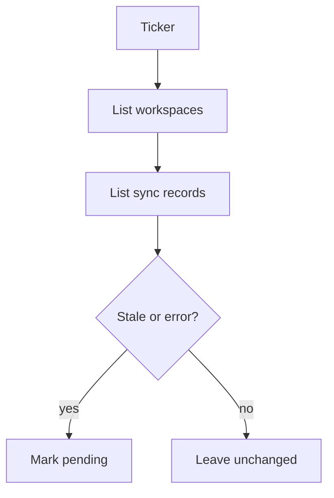

# Internal Sync

Background sync marker for connector sync records.

## Files

| File | Purpose |
| --- | --- |
| `worker.go` | Runs a periodic pass over workspaces and marks stale or errored connector syncs as pending. |

## Behavior

The worker lists workspaces, loads connector sync records, and marks records pending when `LastSyncedAt` is missing, older than the stale cutoff, or already in `error` status. Full re-ingest still happens through user-triggered ingest paths.

## Maintenance Notes

- Keep the worker cancellation-aware through the caller-provided context.
- Do not trigger live connector ingest from this package without updating repository contracts and API status docs.
- Update workspace status docs when sync status values change.
