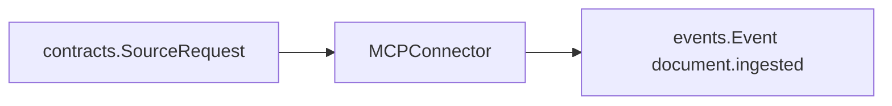
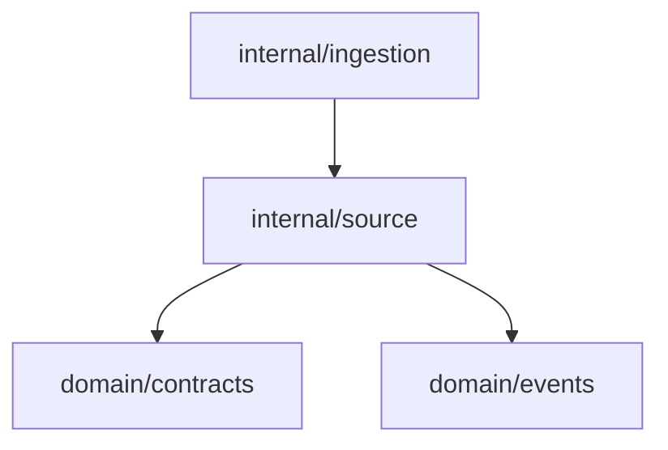

# Source Domain

The source domain converts external systems into ContextOS ingestion events. It is the boundary between tool-specific data and the local-first pipeline.

## Responsibility

- Represent each external source as an `MCPSourceConnector`.
- Validate source requests before producing events.
- Attach connector metadata and provenance.
- Keep connector behavior replay-safe as integrations become real API clients.

## Input And Output



## Core Implementation

`MCPConnector` is the shared current implementation used by all source packages while real API adapters are developed.

```go
type MCPConnector struct {
    name         string
    capabilities []contracts.Capability
}

func NewMCPConnector(name string, capabilities ...contracts.Capability) MCPConnector
func (c MCPConnector) Name() string
func (c MCPConnector) Capabilities() []contracts.Capability
func (c MCPConnector) Ingest(ctx context.Context, req contracts.SourceRequest) ([]events.Event, error)
```

## Behavior

- Respects context cancellation.
- Rejects requests where both `Content` and `URI` are blank.
- Creates metadata with `connector` and `mcp` values.
- Copies `URI` to `source_uri` and `Cursor` to `source_cursor` when present.
- Copies request metadata into the emitted event metadata.
- Uses `URI` as the event subject when present, otherwise uses the connector name.
- Emits a single `document.ingested` event.
- Returns structured `contracts.ConnectorError` values for cancellation and validation failures.

## Connector Wrappers

| Package                                | Name         | Capability    |
| -------------------------------------- | ------------ | ------------- |
| [github](github/github.go)             | `github`     | `repository`  |
| [slack](slack/slack.go)                | `slack`      | `messages`    |
| [jira](jira/jira.go)                   | `jira`       | `issues`      |
| [openapi](openapi/openapi.go)          | `openapi`    | `api_spec`    |
| [excel](excel/excel.go)                | `excel`      | `spreadsheet` |
| [filesystem](filesystem/filesystem.go) | `filesystem` | `files`       |

Each wrapper currently exposes:

```go
func NewConnector() contracts.MCPSourceConnector
```

## Dependencies



## Example Usage

```go
pipe := ingestion.NewPipeline(githubsource.NewConnector())
result, err := pipelines.Run(ctx, pipe, contracts.SourceRequest{
    URI:     "repo://example",
    Content: "presentation layer expects refundStatus but service layer has missingRefundState mismatch",
})
```

## Implementation Notes

- When a connector becomes a real API adapter, preserve the `MCPSourceConnector` contract and keep source-specific parsing inside the connector package.
- Use stable upstream IDs in metadata to support idempotency and replay checks.
- Use `object_type` and `object_id` metadata when connector errors need source artifact provenance.
- Do not let source packages import downstream stages. They should only emit events.
- For large payloads, metadata should point to raw storage while `Content` carries the processing text or summary needed by the next stage.

## Production Requirements

- Each connector must expose stable external artifact IDs and cursor/checkpoint metadata.
- Re-ingesting the same upstream artifact must produce the same logical event identity.
- Connector errors must include connector name, source URI, and retryability.
- Connector output must preserve enough provenance for downstream evidence bundles.
