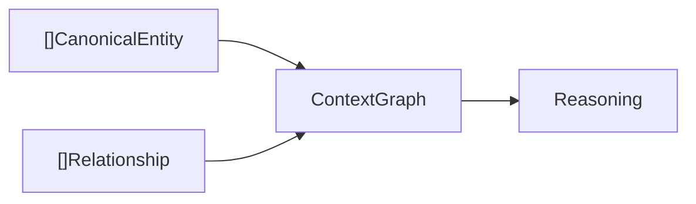
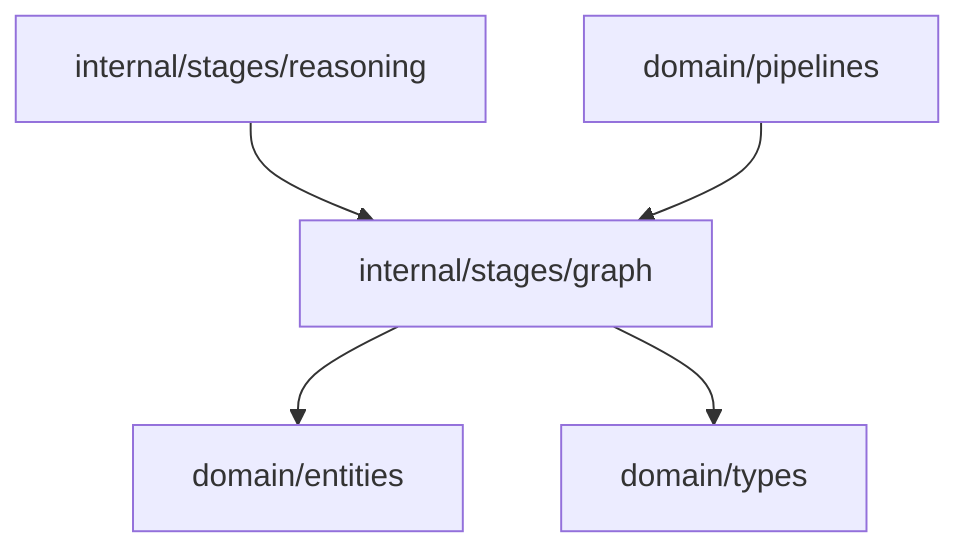

# Context Graph Domain

The graph domain materializes canonical entities and relationships into an in-memory context graph.

## Responsibility

- Store canonical entities by entity ID.
- Store relationships by relationship ID.
- Preserve entity and relationship version history for replay and audit.
- Answer impact queries across connected entities.
- Persist replay-safe local snapshots of graph state.
- Provide the graph structure consumed by reasoning.

## Graph Shape

```go
type ContextGraph struct {
    Entities            map[string]entities.CanonicalEntity   `json:"entities"`
    Relationships       map[string]types.Relationship         `json:"relationships"`
    EntityHistory       map[string][]entities.CanonicalEntity `json:"entity_history"`
    RelationshipHistory map[string][]types.Relationship       `json:"relationship_history"`
}
```

## Key API

```go
func New() *ContextGraph
func (g *ContextGraph) AddEntities(input []entities.CanonicalEntity)
func (g *ContextGraph) AddRelationships(input []types.Relationship)
func (g *ContextGraph) AllEntities() []entities.CanonicalEntity
func (g *ContextGraph) AllRelationships() []types.Relationship
func (g *ContextGraph) Neighbors(entityID string) []types.Relationship
func (g *ContextGraph) ImpactOf(entityID string) []string
func (g *ContextGraph) SaveSnapshot(dir, name string) (string, error)
func LoadSnapshot(path string) (*ContextGraph, error)
```

## Query API

- `Neighbors` returns every relationship incident to an entity (incoming or outgoing).
- `ImpactOf` returns every entity reachable by following directed edges outward, supporting
  impact analysis across requirement, API, DB, service, and dependency artifacts.

## Persistence

- `SaveSnapshot` writes deterministic, indented JSON to `dir/<name>.json` (default location
  `storage/snapshots/`). The same graph state always produces byte-identical output so snapshots
  are replay-safe and usable as regression baselines.
- `LoadSnapshot` reconstructs a `ContextGraph` with entity and relationship history intact and
  rejects unknown on-disk schema versions.
- Snapshots are local-first (filesystem JSON). PostgreSQL and pgvector migrations under
  `migrations/` remain a future, incremental persistence layer.

## Input And Output



## Behavior

- `New` initializes empty entity, relationship, and history maps.
- `AddEntities` overwrites the current entry with the same entity ID and appends the version to history.
- `AddRelationships` overwrites the current entry with the same relationship ID and appends the version to history.
- History is append-only, so prior versions can be replayed and audited instead of being silently lost.

## Dependencies



## Example Usage

```go
contextGraph := graph.New()
contextGraph.AddEntities(canonical)
contextGraph.AddRelationships(relationships)
```

## Implementation Notes

- The current maps are the materialized view for the latest pipeline run; `EntityHistory` and
  `RelationshipHistory` retain every prior version for replay and audit.
- Snapshot persistence is local-first JSON. Snapshots are deterministic so they double as
  regression baselines under `storage/snapshots/`.
- Snapshots preserve aliases, provenance, version history, and relationship evidence because they
  serialize the full canonical entity and typed relationship records.
- The `/graph` API exposes a filtered signal graph by default without deleting snapshot or database
  rows. Use `include_noise=true` on the handler endpoint to inspect low-signal regex entities and
  co-occurrence-only relationships from older runs.
- Permanent noisy graph pruning is separate from graph reads. `POST /graph/cleanup` deletes only
  backend-classified low-signal persisted entity/relationship rows after user confirmation; it does
  not delete source artifacts, findings, chat history, connected sources, workspace rows, or graph
  snapshots.

## Production Requirements

- [x] Persist graph snapshots locally with replayable stage outputs.
- [x] Preserve entity and relationship history rather than only the latest map value.
- [x] Support impact queries across requirement, API, DB, service, and delivery artifacts.
- [x] Expose graph state in a way reasoning and presentation can audit.
- [ ] Back snapshots with PostgreSQL and pgvector once a server-side persistence need is proven.
