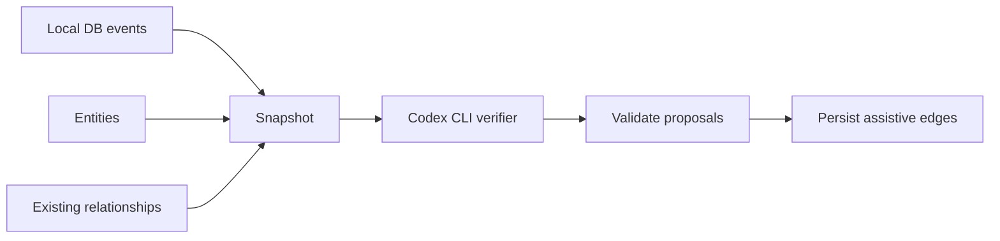

# Graph Verify Stage

Opt-in cross-source relationship verification over Local DB evidence.

## Responsibility

- Build a bounded snapshot from saved Activity events, canonical entities, and existing relationships.
- Ask a verifier assistant for strict JSON relationship proposals.
- Persist only cross-source edges that reference existing entity IDs and saved evidence IDs.

## Behavior

Set `CONTEXTOS_GRAPH_VERIFIER=codex` to use the Codex CLI verifier after live chat evidence
saves. Unset keeps verification disabled. The verifier records accepted edge provenance as
`codex_cli`.

Accepted relationships must:

- reference existing entities from different source documents;
- cite saved event IDs from the snapshot;
- use a known `types.RelationshipKind`;
- have confidence `>= 0.75`;
- pass `relationship.Validate`.

## Maintenance Notes

- Keep verifier input local-only; it must not re-query Jira, GitHub, Slack, or Drive.
- Keep output strict and parseable through `CONTEXTOS_GRAPH_VERIFY_JSON:`.
- Add fixtures before widening relationship kinds or evidence acceptance rules.
