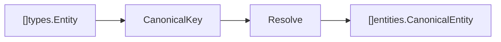
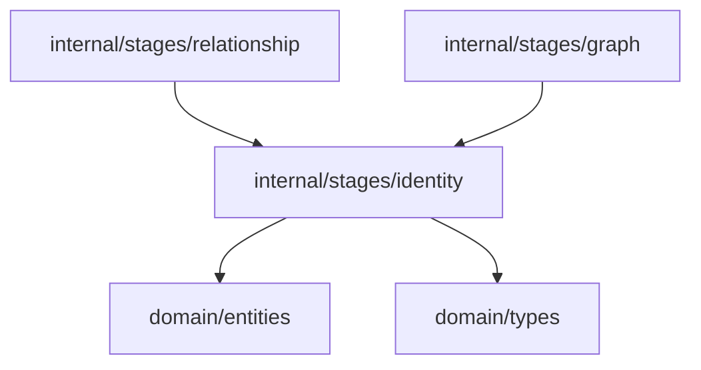

# Identity Resolution Domain

Identity resolution is the core ContextOS domain. It merges candidate entities that represent the same concept into canonical identities.

## Responsibility

- Convert extracted `types.Entity` values into `entities.CanonicalEntity` values.
- Merge equivalent names through deterministic exact-key and naming-convention layers.
- Propose (but never auto-merge) semantic candidates for human review.
- Preserve aliases, provenance evidence, and source IDs through resolution.
- Return canonical entities in first-seen order with confidence and human-review state.

## Input And Output



## Key API

```go
func Resolve(input []types.Entity) []entities.CanonicalEntity
func ResolveWithMatcher(input []types.Entity, matcher Matcher, opts MatchOptions) []entities.CanonicalEntity
func CanonicalKey(value string) string
func ConventionAliases(name string) []string
```

Matchers:

```go
type Matcher interface{ Similarity(a, b string) float64 }
type Embedder interface{ Embed(texts []string) ([][]float64, error) }

type LocalMatcher struct{}            // default, network-free trigram-cosine matcher
type WorkerMatcher struct{ Embedder } // opt-in, embedding-service backed matcher
```

## Canonical Key Rules

`CanonicalKey` applies two operations:

1. Trim surrounding whitespace and lowercase the value.
2. Replace non-`a-z0-9` runs with an empty string.

Examples:

| Input           | Key            |
| --------------- | -------------- |
| `refund_status` | `refundstatus` |
| `Refund Status` | `refundstatus` |
| `refund-status` | `refundstatus` |

## Resolution Layers

Resolution runs in deterministic layers so the default pipeline stays hermetic and replay-safe:

1. **Exact** — `Resolve` groups entities by `CanonicalKey(entity.Name)` and merges identical keys.
2. **Convention** — when merged surface forms differ (e.g. `refundStatus` vs `refund_status`),
   the merge is recorded with `MatchLayerConvention` evidence. `ConventionAliases` exposes the
   snake/kebab/camel/Pascal/SCREAMING variants of a name.
3. **Semantic (opt-in)** — `ResolveWithMatcher` runs the exact and convention layers, then uses a
   `Matcher` to propose semantic candidates between distinct canonical entities. Semantic matches
   are recorded as `MergeCandidate` values and set `NeedsHuman=true`; they are **never auto-merged**,
   so downstream stages remain deterministic.

`Resolve` is the default used by the pipeline. `ResolveWithMatcher` with a nil matcher falls back
to `LocalMatcher` (a deterministic character-trigram cosine, no network). `WorkerMatcher` is only
used when a caller explicitly passes it with an `Embedder` (the `internal/worker/aiworker` client).

## Conflict Handling

When merged aliases disagree on `EntityType`, the canonical entity is flagged with
`NeedsHuman=true`, a reduced `Confidence`, and a `ConflictReason`. Semantic candidates also set
`NeedsHuman=true` with a review reason, keeping high-impact ambiguous merges out of the automatic path.

## Benchmark

A labelled dataset at [`tests/harness/fixtures/identity/benchmark-dataset.csv`](../../../tests/harness/fixtures/identity/benchmark-dataset.csv)
covers exact, convention, multilingual, and synonym aliases plus negative pairs. Run it with:

```sh
go test ./internal/stages/identity/... -run BenchmarkIdentityResolution -v
```

The benchmark reports precision, recall, false-merge, conflict, and needs-human counts and gates on
precision ≥ 0.99, recall ≥ 0.90, and zero false merges.

## Dependencies



## Example Usage

```go
canonical := identity.Resolve(extracted)
```

## Implementation Notes

- Exact and convention layers are deterministic and run by default; semantic matching is opt-in and only proposes review candidates.
- `Confidence` is `1` for clean deterministic merges, reduced when a type conflict needs review.
- Semantic and conflict merges preserve evidence, explain confidence, and set `NeedsHuman` for ambiguous cases.
- Keep alias order stable. It is useful for deterministic tests and human inspection.
- `WorkerMatcher` fails closed (returns score `0`) on any embedding error so the pipeline never panics.

## Production Requirements

- Support alias dictionaries, naming-convention transforms, multilingual aliases, and semantic candidates.
- Score candidates with explainable evidence and calibrated confidence.
- Detect conflicting merges and set `NeedsHuman` with review reasons.
- Maintain benchmark coverage for precision, recall, multilingual names, and merge conflicts.
