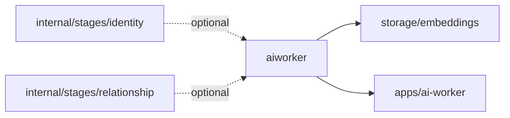

# Worker Clients

The `internal/worker` tree contains Go clients for optional assistive worker services. Worker output can improve matching or scoring, but deterministic evidence and domain contracts remain authoritative.

## Packages

| Package | Responsibility |
| --- | --- |
| [`aiworker/`](aiworker/README.md) | Calls and caches the local Python AI worker for embeddings and semantic assistive behavior. |

## Worker Boundary

Worker clients should fail soft when optional worker services are unavailable.

## Maintenance Checklist

- Update [`aiworker/`](aiworker/README.md) when worker endpoints, cache behavior, or embedding semantics change.
- Keep worker calls optional and bounded by caller context.
- Run worker client tests after changing request, response, or cache behavior.
