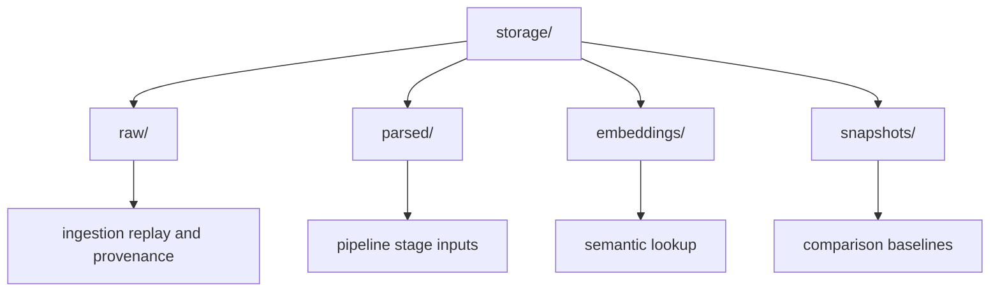
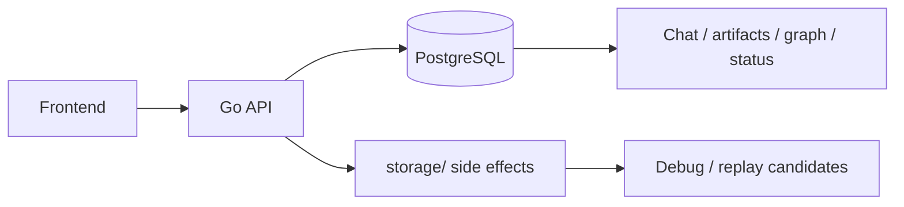

# Storage

This folder stores local runtime files and derived artifacts used by ingestion and downstream analysis.

Important: `storage/` is not the product source of truth today. The frontend reads most product state from PostgreSQL (`workspaces`, `ingest_events`, `entities`, `relationships`, `mismatches`, and `connector_syncs`). Files in `storage/` are staging files, caches, parsed side outputs, or graph snapshots unless a future storage contract says otherwise.

## Layout



| Path | Responsibility | Update when |
| --- | --- | --- |
| [`raw/`](raw/README.md) | Browser upload staging and future raw replay store. | Upload staging, raw retention, or replay contracts change. |
| [`parsed/`](parsed/README.md) | Normalized side outputs for debug and replay inspection. | Normalization writer output or parsed artifact layout changes. |
| [`embeddings/`](embeddings/README.md) | Disposable local embedding cache. | Cache format, retention, or embedding model assumptions change. |
| [`snapshots/`](snapshots/README.md) | Generated graph snapshots and regression/debug output. | Snapshot format, comparison rules, or retention changes. |
| [`db/`](db/README.md) | PostgreSQL open/migration helpers used by the API. | DB bootstrap, migration application, or connection behavior changes. |

Runtime subtrees under `storage/raw/uploads/`, `storage/parsed/*`, `storage/embeddings/`, and `storage/snapshots/*` are generated artifacts. Do not document their contents file-by-file; document the owning folder contract instead.

## Current Product Source Of Truth



Use this rule until the storage replan is implemented:

```text
Postgres = product truth
storage/raw = upload staging and future raw replay store
storage/parsed = derived debug output
storage/embeddings = cache
storage/snapshots = debug/regression output
```

## Retention Notes

- Keep generated files reproducible where possible.
- Do not store secrets or private credentials in tracked files.
- Prefer deterministic filenames for benchmark and regression comparison.

## Maintenance Checklist

- Update subfolder READMEs when storage contracts change.
- Document cleanup or rotation procedures when introduced.
- Keep storage usage aligned with local-first project direction.
