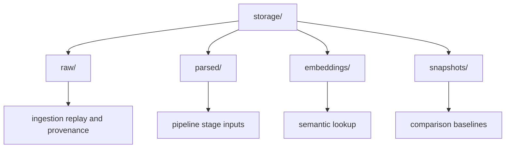

# Storage

This folder stores local-first artifacts used by ingestion and downstream analysis.

## Layout

- `raw/`: source artifacts and uploaded files.
- `parsed/`: extracted and transformed intermediate outputs.
- `embeddings/`: vector or embedding artifacts.
- `snapshots/`: generated snapshots and baseline outputs.

## Retention Notes

- Keep generated files reproducible where possible.
- Do not store secrets or private credentials in tracked files.
- Prefer deterministic filenames for benchmark and regression comparison.

## Maintenance Checklist

- Update subfolder READMEs when storage contracts change.
- Document cleanup or rotation procedures when introduced.
- Keep storage usage aligned with local-first project direction.
