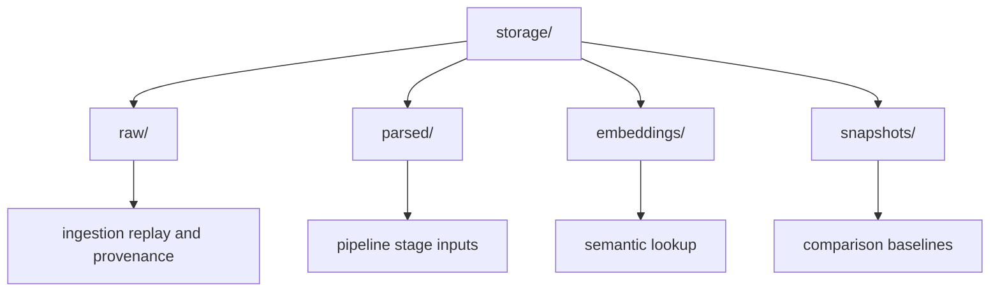
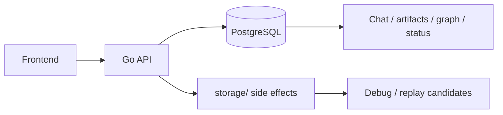

# Storage

This folder stores local runtime files and derived artifacts used by ingestion and downstream analysis.

Important: `storage/` is not the product source of truth today. The frontend reads most product state from PostgreSQL (`workspaces`, `ingest_events`, `entities`, `relationships`, `mismatches`, and `connector_syncs`). Files in `storage/` are staging files, caches, parsed side outputs, or graph snapshots unless a future storage contract says otherwise.

For the current storage/database audit and reset plan, see [docs/STORAGE_DB_REPLAN.md](../docs/STORAGE_DB_REPLAN.md).

## Layout



- `raw/`: currently browser upload staging; not yet a complete durable raw source store.
- `parsed/`: normalized document side outputs for debug/replay inspection.
- `embeddings/`: disposable local embedding cache.
- `snapshots/`: generated graph snapshots and baseline outputs; currently not read by the UI.

## Current Product Source Of Truth



Use this rule until the storage replan is implemented:

```text
Postgres = product truth
storage/raw = upload staging and future raw replay store
storage/parsed = derived debug output
storage/embeddings = cache
storage/snapshots = debug/regression output
```

## Retention Notes

- Keep generated files reproducible where possible.
- Do not store secrets or private credentials in tracked files.
- Prefer deterministic filenames for benchmark and regression comparison.

## Maintenance Checklist

- Update subfolder READMEs when storage contracts change.
- Document cleanup or rotation procedures when introduced.
- Keep storage usage aligned with local-first project direction.
