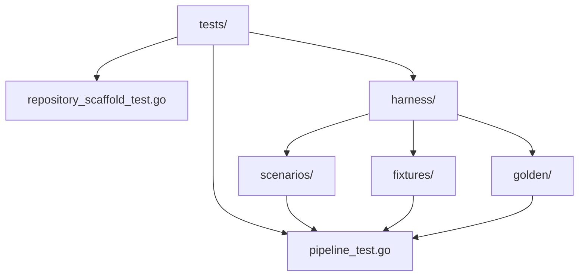

# Tests

This folder contains repository-level and cross-stage test suites.

## Test Flow

## Scope

- End-to-end and cross-stage pipeline behavior checks.
- Repository scaffold and structural integrity checks.
- Harness-oriented tests under `tests/harness/`.

## Run Commands

- `go test ./...` for full Go test coverage.
- Targeted package tests can be run during local iteration.

## Maintenance Checklist

- Add tests when behavior, contracts, or orchestration changes.
- Keep fixture/golden/scenario docs synced in `tests/harness/README.md`.
- Ensure failures provide actionable diagnostics.
